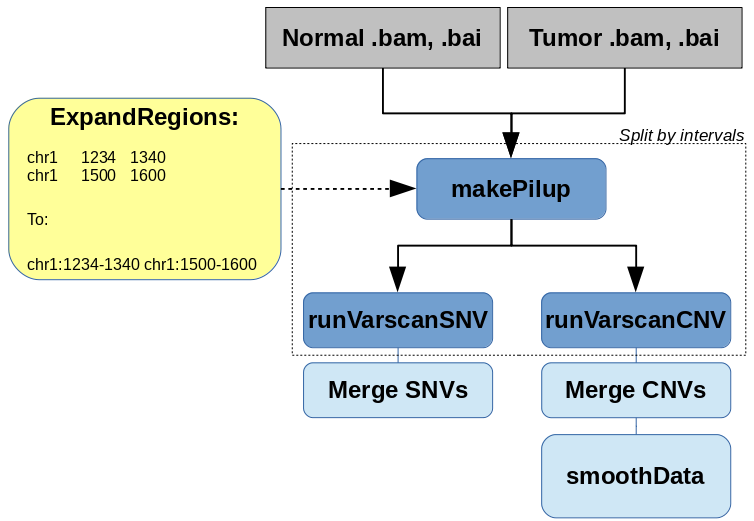

# varscan

Varscan 2.2, workflow for calling SNVs and CVs
Creation of mpileups and calling variants are done with parallel processing


## Dependencies

* [picard 2.21.2](https://broadinstitute.github.io/picard)
* [varscan 2.4.2](http://varscan.sourceforge.net)
* [samtools 0.1.19](http://www.htslib.org/)
* [rstats 3.6](http://cran.utstat.utoronto.ca/src/base/R-3/R-3.6.1.tar.gz)


## Usage

### Cromwell
```
java -jar cromwell.jar run varscan.wdl --inputs inputs.json
```

### Inputs

#### Required workflow parameters:
Parameter|Value|Description
---|---|---
`inputTumor`|File|input .bam file for tumor sample
`inputNormal`|File|input .bam file for normal sample
`inputTumorIndex`|File|input .bai file for tumor sample
`inputNormalIndex`|File|input .bai file for normal sample
`reference`|String|Reference id for the assembly


#### Optional workflow parameters:
Parameter|Value|Default|Description
---|---|---|---
`outputFileNamePrefix`|String|""|Output file(s) prefix
`bedIntervalsPath`|String|""|Path to a .bed file used for splitting pileup job/limiting analysis to selected regions
`chromRegions`|Array[String]|""|Regions used for scattering tasks, need to be assembly-specific


#### Optional task parameters:
Parameter|Value|Default|Description
---|---|---|---
`expandRegions.modules`|String|"hg38-dac-exclusion/1.0"|required modules (This is to allow modularized data for bed path)
`expandRegions.jobMemory`|Int|4|Memory for this task in GB
`expandRegions.timeout`|Int|12|Timeout in hours, needed to override imposed limits
`makePileups.refFasta`|String||Reference fasta file, path depends on the respective module
`makePileups.modules`|String|""|required modules
`makePileups.samtools`|String|"$SAMTOOLS_ROOT/bin/samtools"|path to samtools
`makePileups.jobMemory`|Int|18|memory for this job, in Gb
`makePileups.timeout`|Int|40|Timeout in hours, needed to override imposed limits
`runVarscanCNV.pValue`|Float|0.05|p-value for cnv calling, default is 0.05
`runVarscanCNV.jobMemory`|Int|20|Memory in Gb for this job
`runVarscanCNV.javaMemory`|Int|6|Memory in Gb for Java
`runVarscanCNV.logFile`|String|"VARSCAN_CNV.log"|File for logging Varscan messages
`runVarscanCNV.varScan`|String|"$VARSCAN_ROOT/VarScan.jar"|path to varscan .jar file
`runVarscanCNV.modules`|String|"varscan/2.4.2 java/8"|Names and versions of modules
`runVarscanCNV.timeout`|Int|40|Timeout in hours, needed to override imposed limits
`getSnvNative.pValue`|Float|0.05|somatic p-value for SNV calling, default is 0.05
`getSnvNative.jobMemory`|Int|20|Memory in Gb for this job
`getSnvNative.javaMemory`|Int|6|Memory in Gb for Java
`getSnvNative.minCoverage`|Int|8|Minimum coverage in normal and tumor to call variant [8]
`getSnvNative.minCoverageNormal`|Int|8|Minimum coverage in normal to call somatic [8]
`getSnvNative.minCoverageTumor`|Int|6|Minimum coverage in tumor to call somatic [6]
`getSnvNative.minVarFreq`|Float|0.1|Minimum variant frequency to call a heterozygote [0.10]
`getSnvNative.minFreqForHom`|Float|0.75|Minimum frequency to call homozygote [0.75]
`getSnvNative.normalPurity`|Float|1.0|Estimated purity (non-tumor content) of normal sample [1.00]
`getSnvNative.tumorPurity`|Float|1.0|Estimated purity (tumor content) of normal sample [1.00]
`getSnvNative.pValueHet`|Float|0.99|p-value threshold to call a heterozygote [0.99]
`getSnvNative.strandFilter`|Int|0|If set to 1, removes variants with >90% strand bias
`getSnvNative.validation`|Int|0|If set to 1, outputs all compared positions even if non-variant
`getSnvNative.outputVcf`|Int|0|Flag that when set to 1 indicates that we need results in vcf format
`getSnvNative.logFile`|String|"VARSCAN_SNV.log"|File for logging Varscan messages
`getSnvNative.varScan`|String|"$VARSCAN_ROOT/VarScan.jar"|path to varscan .jar file
`getSnvNative.modules`|String|"varscan/2.4.2 java/8"|Names and versions of modules
`getSnvNative.timeout`|Int|40|Timeout in hours, needed to override imposed limits
`getSnvVcf.pValue`|Float|0.05|somatic p-value for SNV calling, default is 0.05
`getSnvVcf.jobMemory`|Int|20|Memory in Gb for this job
`getSnvVcf.javaMemory`|Int|6|Memory in Gb for Java
`getSnvVcf.minCoverage`|Int|8|Minimum coverage in normal and tumor to call variant [8]
`getSnvVcf.minCoverageNormal`|Int|8|Minimum coverage in normal to call somatic [8]
`getSnvVcf.minCoverageTumor`|Int|6|Minimum coverage in tumor to call somatic [6]
`getSnvVcf.minVarFreq`|Float|0.1|Minimum variant frequency to call a heterozygote [0.10]
`getSnvVcf.minFreqForHom`|Float|0.75|Minimum frequency to call homozygote [0.75]
`getSnvVcf.normalPurity`|Float|1.0|Estimated purity (non-tumor content) of normal sample [1.00]
`getSnvVcf.tumorPurity`|Float|1.0|Estimated purity (tumor content) of normal sample [1.00]
`getSnvVcf.pValueHet`|Float|0.99|p-value threshold to call a heterozygote [0.99]
`getSnvVcf.strandFilter`|Int|0|If set to 1, removes variants with >90% strand bias
`getSnvVcf.validation`|Int|0|If set to 1, outputs all compared positions even if non-variant
`getSnvVcf.logFile`|String|"VARSCAN_SNV.log"|File for logging Varscan messages
`getSnvVcf.varScan`|String|"$VARSCAN_ROOT/VarScan.jar"|path to varscan .jar file
`getSnvVcf.modules`|String|"varscan/2.4.2 java/8"|Names and versions of modules
`getSnvVcf.timeout`|Int|40|Timeout in hours, needed to override imposed limits
`mergeCNV.jobMemory`|Int|6|memory in GB for this job
`mergeCNV.timeout`|Int|10|Timeout in hours, needed to override imposed limits
`mergeSNP.jobMemory`|Int|6|memory in GB for this job
`mergeSNP.timeout`|Int|10|Timeout in hours, needed to override imposed limits
`mergeIND.jobMemory`|Int|6|memory in GB for this job
`mergeIND.timeout`|Int|10|Timeout in hours, needed to override imposed limits
`mergeSNPvcf.modules`|String|""|modules needed for this task
`mergeSNPvcf.seqDictionary`|String|""|.dict file for the reference in use
`mergeSNPvcf.jobMemory`|Int|12|memory in GB for this job
`mergeSNPvcf.javaMemory`|Int|8|memory in GB for java VM
`mergeSNPvcf.timeout`|Int|10|Timeout in hours, needed to override imposed limits
`mergeINDvcf.modules`|String|""|modules needed for this task
`mergeINDvcf.seqDictionary`|String|""|.dict file for the reference in use
`mergeINDvcf.jobMemory`|Int|12|memory in GB for this job
`mergeINDvcf.javaMemory`|Int|8|memory in GB for java VM
`mergeINDvcf.timeout`|Int|10|Timeout in hours, needed to override imposed limits
`smoothData.varScan`|String|"$VARSCAN_ROOT/VarScan.jar"|Path to VarScan jar file
`smoothData.modules`|String|"varscan/2.4.2 java/8 rstats/3.6"|Modules for this job
`smoothData.min_coverage`|Int|20|Fine-tuning parameter for VarScan
`smoothData.max_homdel_coverage`|Int|5|Max coverage form homozygous deletion, default is 5
`smoothData.min_tumor_coverage`|Int|10|Min coverage in tumor sample, default is 10
`smoothData.del_threshold`|Float|0.25|Fine-tuning parameter for VarScan
`smoothData.amp_threshold`|Float|0.25|Amplification threshold to report, default is 0.25
`smoothData.min_region_size`|Int|10|Fine-tuning parameter for VarScan
`smoothData.recenter_up`|Int|0|Fine-tuning parameter for VarScan
`smoothData.recenter_down`|Int|0|Fine-tuning parameter for VarScan
`smoothData.jobMemory`|Int|16|Memory in Gb for this job
`smoothData.javaMemory`|Int|6|Memory in Gb for Java


### Outputs

Output | Type | Description
---|---|---
`resultCnvFile`|File?|file with CNV calls, smoothed
`resultSnpFile`|File|file with SNPs, native varscan format
`resultIndelFile`|File|file with Indel calls, native varscan format
`resultSnpVcfFile`|File|file with SNPs, vcf format
`resultIndelVcfFile`|File|file with Indels, vcf format


## Commands
 
 This section lists command(s) run by varscan workflow
 
 ### Running varscan
 
 Varscan is used to call SNV and CV events
 
  * Preprocessing
 
 bed file re-format to be used with scattered pileup creation. Note that it should be a resonable ( <100 perhaps? ) intervals
 so that we do not end up with a million jobs running. Use wisely, as it may result in grabbing a lot of compute nodes.
 
 ```
  In this embedded script we reformat bed lines into varscan-friendly intervals
 
  import os
  if os.path.exists("~{bedPath}"):
     with open("~{bedPath}") as f:
         for line in f:
            line = line.rstrip()
            tmp = line.split("\t")
            r = " " + tmp[0] + ":" + tmp[1] + "-" + tmp[2]
            print(r)
     f.close()
 
 ```
 
  * Run samtools mpileup
 
 ```
  samtools mpileup -q 1 -r REGION -f REF_FASTA INPUT_NORMAL INPUT_TUMOR | awk -F "\t" '$4 > 0 && $7 > 0' | gzip -c > normtumor_sorted.pileup.gz 
 
 ```
 
  * Remove mitochondrial chromosome:
 
 ```
  head -n 1 ~{filePaths[0]} > "~{outputFile}.~{outputExtension}"
  cat ~{sep=' ' filePaths} | sort -V -k 1,2 | grep -v ^chrom | grep -v ^chrM >> "~{outputFile}.~{outputExtension}"
  cat ~{sep=' ' filePaths} | awk '{if($1 == "chrM"){print $0}}' | sort -V -k 1,2 >> "~{outputFile}.~{outputExtension}"
  if [ ! -s ~{outputFile}.~{outputExtension} ] ; then
   rm ~{outputFile}.~{outputExtension}
  fi
 ```
 
  * Sort vcf using sequence dictionary
 
 ```
  java -Xmx[MEMORY]G -jar picard.jar SortVcf I=INPUT_VCFS SD=SEQ_DICTIONARY O=OUTPUT_FILE.SUFFIX.vcf
 
 ```
 
  * SNP/Indel Calling:
 
 ```
   See the full source code in .wdl, here we run this command:
 
   zcat INPUT_PILEUP | java -Xmx[MEMORY]G -jar varscan somatic -mpileup 1 
      --somatic-p-value P_VALUE
 
      Optional parameters:
 
     --min-coverage-normal MIN_COVERAGE_NORMAL
     --min-coverage-tumor  MIN_COVERAGE_TUMOR
     --min-var-freq MIN_VAR_FREQUENCY
     --min-freq-for-hom MIN_FREQUENCY_FOR_HOM
     --normal-purity NORMAL_PURITY
     --tumor-purity TUMOR_PURIY
     --p-value P_VALUE_HET
     --strand-filter 1
     --validation 1
     --output-vcf 1
     
     Settings for output format:
 
     --output-snp SAMPLE_ID.snp.vcf --output-indel SAMPLE_ID.indel.vcf
   
     or:
 
     --output-snp SAMPLE_ID.snp --output-indel SAMPLE_ID.indel
 
 ```
 
  * Find minimum coverage threshold for CV analysis:
 
 ```
 
 A python code configures and runs this command: 
 
 zcat ~{inputPileup} | java -Xmx~{javaMemory}G -jar " + varscan + " copynumber --output-file ~{sampleID} -mpileup 1 --p-value ~{pValue}"
 
 Varscan reports if the coverage threshold was sufficient for the analysis. We use this coverage setting in the next step
 
 ```
 
 ### Run copy number change analysis:
 
 ```
 
 A python code configures and runs this command:
  
 java -Xmx[MEMORY]G -jar varscan copyCaller CV_FILE 
                    --output-file SAMPLE_ID.copynumber.filtered
                    --min-coverage MIN_COVERAGE # Value found in the previous step
 
                     Optional parameters:
 
                    --min-tumor-coverage  MIN_TUMOR_COVERAGE
                    --max-homdel-coverage MAX_HOMDEL_COVERAGE
                    --del-threshold   DEL_THRESHOLD
                    --amp-threshold   AMP_THRESHOLD
                    --min-region-size MIN_REGION_SIZE
                    --recenter-up     RECENTER_UP
                    --recenter-down   RECENTER_DOWN
 
 ```
 
 ## Support

For support, please file an issue on the [Github project](https://github.com/oicr-gsi) or send an email to gsi@oicr.on.ca .

_Generated with generate-markdown-readme (https://github.com/oicr-gsi/gsi-wdl-tools/)_
